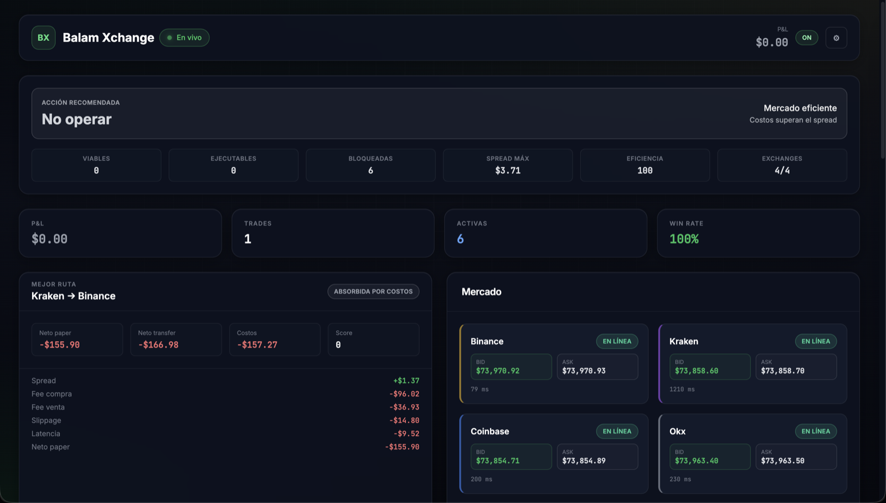
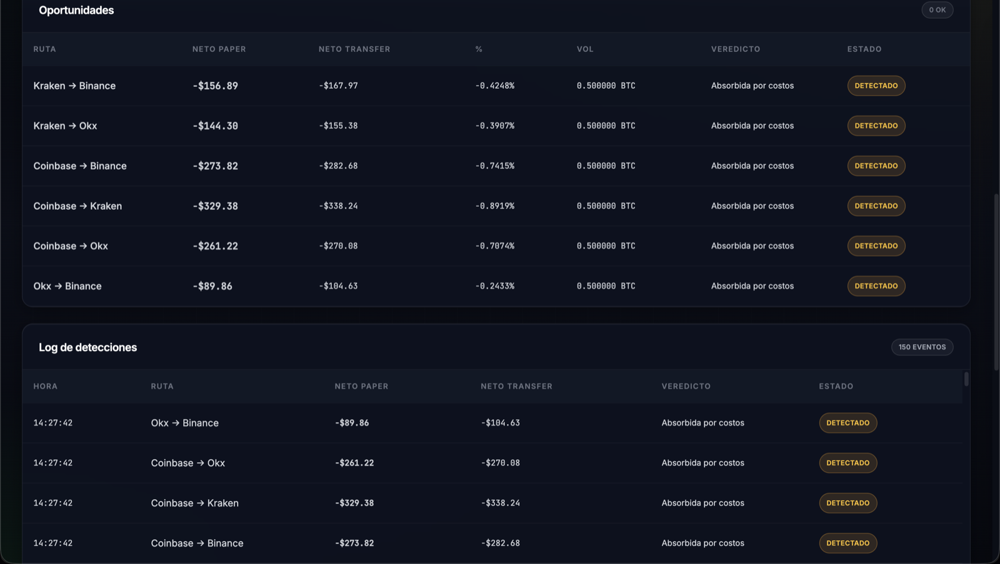
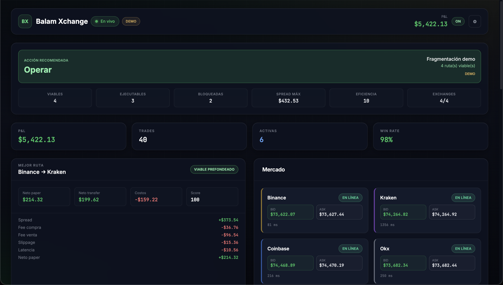
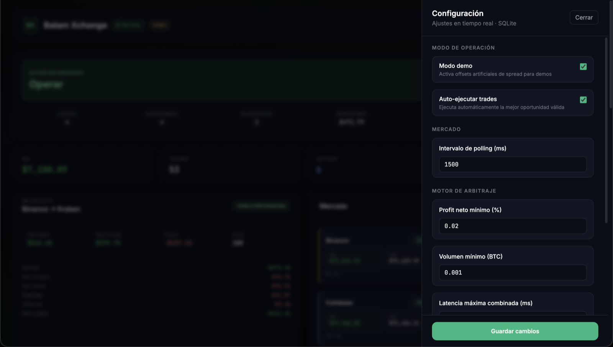
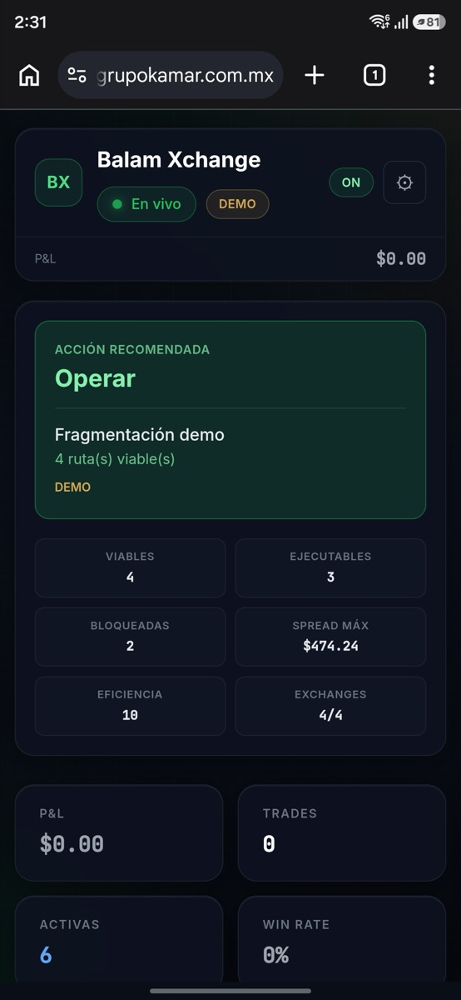

# Balam Xchange

**Motor inteligente de arbitraje de Bitcoin en tiempo real**

> **Demo en vivo:** https://balam-xchange.grupokamar.com.mx  
> **Repositorio:** https://github.com/ManuelCanulDev/Coding_Challenge_Mexico

Balam Xchange es una web app full-stack que monitorea order books públicos de BTC, detecta arbitraje cross-exchange, calcula rentabilidad neta (fees, slippage, latencia), simula ejecución con wallets virtuales y expone un dashboard en vivo vía WebSocket.

> **Paper trading únicamente.** Sin órdenes reales. Sin API keys privadas.

### Evaluar en 2 minutos (guía para jurado)

1. Abre la URL desplegada → verifica indicador **Live** (verde) en el header.
2. **Modo live** (`demoMode: false` en ⚙): barra **Acción: No operar** — mercado real eficiente; oportunidades `detected` con costos > spread.
3. Activa **Modo demo** en ⚙ → en ~10 s: **Acción: Operar**, trades en historial, P&L sube.
4. Revisa **Log de detecciones** (últimas 150) y columnas **Neto paper** vs **Neto transfer** (fees de retiro BTC).
5. Cambia a live de nuevo → sesión se resetea (trades/P&L independientes por modo).

---

## 1. Descripción del proyecto

Bitcoin cotiza de forma simultánea en múltiples exchanges. Los precios bid/ask no están perfectamente alineados: en ventanas breves puede ser más barato comprar BTC en un venue y venderlo en otro que operar en un solo mercado.

Balam Xchange implementa el ciclo completo de un motor de arbitraje simulado:

1. **Recolección** de order books públicos vía CCXT (Binance, Kraken, Coinbase, OKX).
2. **Detección** cuando `buyExchange.ask < sellExchange.bid` en todos los pares.
3. **Evaluación** de rentabilidad neta (fees, slippage, latencia) + **Veredicto Balam** (neto prefondeado vs neto con retiro BTC).
4. **Ejecución simulada** con fills parciales, circuit breaker y priorización por score.
5. **Log de detecciones** (ring buffer 150) + historial de trades y P&L por WebSocket.
6. **Configuración runtime** en SQLite (`demoMode`, umbrales, auto-ejecutar) desde panel ⚙.

**Diferenciador:** no solo detecta spreads — explica por qué el arbitraje serial (comprar → retirar BTC → vender) casi nunca es viable en la práctica.

---

## 2. Objetivo del challenge

El challenge pide construir un sistema que:

- Monitoree precios y order books de BTC en múltiples exchanges.
- Detecte oportunidades de arbitraje cross-exchange.
- Calcule si el spread sigue siendo rentable después de costos operativos.
- Simule la ejecución y presente resultados de forma clara para revisión técnica.

Balam Xchange cumple ese objetivo de extremo a extremo: datos públicos → oportunidades puntuadas → ejecución simulada → historial, P&L acumulado y salvaguardas de riesgo, dentro del alcance de un MVP de hackathon.

---

## 3. Stack tecnológico

### Frontend

| Tecnología | Uso |
|------------|-----|
| React 19 + TypeScript | UI del dashboard |
| Vite | Dev server y build |
| TailwindCSS | Diseño oscuro responsive |
| Recharts | Gráfica de P&L acumulado |
| WebSocket client | Estado en vivo + reconexión automática |
| localStorage | Persistencia de historial al recargar |

### Backend

| Tecnología | Uso |
|------------|-----|
| Node.js + TypeScript | Runtime y tipado |
| Express | REST (`/health`, `/api/state`) |
| ws | Broadcast WebSocket dedicado |
| CCXT | Order books públicos (sin API keys) |
| In-memory state | Orquestación vía `AppOrchestrator` |

### Deployment

| Entorno | Estado |
|---------|--------|
| Local (npm workspaces) | ✅ |
| Docker + Docker Compose | ✅ (`docker compose up --build`) |
| Coolify (Dockerfile) | ✅ Puerto `3001`, health `/health`, volumen `/app/backend/data` |
| Railway / Render / Fly | ✅ Compatible (mismo contenedor) |

---

## 4. Arquitectura del proyecto

```
balam-xchange/
├── backend/
│   ├── src/
│   │   ├── config.ts
│   │   ├── index.ts
│   │   ├── types/
│   │   ├── services/
│   │   │   ├── orderBookService.ts    # CCXT + normalización
│   │   │   ├── mockDataService.ts     # Fallback si falla un exchange
│   │   │   ├── arbitrageEngine.ts     # Detección de oportunidades
│   │   │   ├── slippageService.ts     # Slippage, latencia, score
│   │   │   ├── realityCheckService.ts # Veredicto + withdrawal fees
│   │   │   ├── opportunityLogService.ts # Log ring buffer (150)
│   │   │   ├── settingsService.ts     # SQLite runtime config
│   │   │   ├── walletService.ts       # Wallets y ejecución simulada
│   │   │   ├── riskEngine.ts          # Validación y circuit breaker
│   │   │   └── orchestrator.ts        # Polling + auto-ejecución
│   │   └── websocket/
│   │       └── wsServer.ts
│   ├── .env.example
│   └── package.json
├── frontend/
│   ├── src/
│   │   ├── components/                # Secciones del dashboard
│   │   ├── hooks/useWebSocket.ts
│   │   ├── types/
│   │   └── utils/format.ts
│   ├── .env.example
│   └── vite.config.ts
├── screenshots/
├── package.json
├── .gitignore
└── README.md
```

### Flujo de datos

```
CCXT (APIs públicas)
    → OrderBookService (normalización + fallback mock)
    → ArbitrageEngine (detección + score)
    → RiskEngine + WalletService (validación + ejecución simulada)
    → AppOrchestrator (estado unificado)
    → WebSocket broadcast
    → Dashboard React
```

**Decisión técnica:** WebSocket comparte el puerto HTTP en la ruta `/ws`, simplificando CORS, deploy y Docker con un solo puerto expuesto.

---

## 5. Instalación

### Requisitos

- Node.js 20+
- npm 10+
- Acceso a internet (APIs públicas de exchanges)

### Pasos

```bash
git clone https://github.com/ManuelCanulDev/Coding_Challenge_Mexico.git
cd Coding_Challenge_Mexico
npm install
```

Opcional — variables de entorno:

```bash
cp backend/.env.example backend/.env
cp frontend/.env.example frontend/.env
```

---

## 6. Ejecución local

Desde la **raíz del repositorio**:

```bash
npm run dev
```

Levanta backend y frontend en paralelo.

| Servicio | URL |
|----------|-----|
| Frontend | http://localhost:5173 |
| Backend (HTTP) | http://localhost:3001 |
| WebSocket | ws://localhost:3001/ws |

### Servicios individuales

```bash
npm run dev:backend   # solo backend (desde la raíz)
npm run dev:frontend  # solo frontend (desde la raíz)
```

Desde `backend/`:

```bash
npm run dev
```

### Build de producción

```bash
npm run build
cd backend && npm start   # API compilada en backend/dist
```

---

## 7. Docker / Coolify

El repositorio incluye `Dockerfile`, `docker-compose.yml` y `.env.coolify.example` para deployment en **un solo puerto** (HTTP + API + WebSocket `/ws` + dashboard estático).

### Local con Docker

```bash
docker compose up --build
```

App en http://localhost:3001

### Deploy en Coolify (recomendado)

1. **Nuevo recurso** → tipo **Application** → fuente **GitHub** → selecciona este repo.
2. **Build pack:** Dockerfile (raíz del monorepo).
3. **Puerto expuesto:** `3001` (debe coincidir con `PORT`).
4. **Health check:** ruta `/health`, puerto `3001`.
5. **Variables de entorno** (ver `.env.coolify.example`):

   | Variable | Valor |
   |----------|-------|
   | `NODE_ENV` | `production` (**solo Runtime**, no Buildtime) |
   | `PORT` | `3001` |
   | `CORS_ORIGIN` | `https://balam-xchange.grupokamar.com.mx` |
   | `DEMO_MODE` | `true` (semilla inicial; luego editable en ⚙) |
   | `SETTINGS_DB_PATH` | `/app/backend/data/settings.sqlite` |

   > Si `NODE_ENV=production` está marcado como **Available at Buildtime**, el build puede fallar con `tsc: not found`. Desmarca Buildtime o déjalo solo en Runtime.

6. **Almacenamiento persistente:** monta un volumen en `/app/backend/data` para conservar `settings.sqlite` entre redeploys.
7. **Dominio:** asigna el FQDN en Coolify (HTTPS automático con proxy integrado).
8. Tras el deploy, abre la URL → indicador **Live** verde → WebSocket en `wss://balam-xchange.grupokamar.com.mx/ws` (same-origin, sin variables `VITE_*`).

**Alternativa:** recurso **Docker Compose** apuntando al `docker-compose.yml` del repo (incluye volumen `balam-data`).

### Railway / Render

1. Conecta el repo de GitHub.
2. Build: Dockerfile en la raíz (o `npm run build` + `node backend/dist/index.js`).
3. Puerto: `3001` · `NODE_ENV=production`
4. Variables: `PORT=3001`, `CORS_ORIGIN=https://tu-dominio.com`
5. Ajustes runtime (`demoMode`, etc.) desde el panel ⚙ — persisten en SQLite si montas volumen en `/app/backend/data`.

**Desarrollo en contenedor (perfil opcional):**

```bash
docker compose --profile dev up
```

---

## 8. Variables de entorno

### Backend (`backend/.env`) — solo infraestructura

| Variable | Default | Descripción |
|----------|---------|-------------|
| `PORT` | `3001` | Puerto HTTP + WebSocket (`/ws`) |
| `CORS_ORIGIN` | `http://localhost:5173,...` | Orígenes CORS (coma-separados) |
| `SETTINGS_DB_PATH` | *(auto)* | Ruta SQLite; en Coolify: `/app/backend/data/settings.sqlite` |
| `STRICT_LIVE` | `false` | `true` = sin fallback mock si falla un exchange (recomendado en prod) |
| `FX_USDT_USD_RATE` | `1` | Fallback USDT→USD si falla Kraken (feed live ~60 s) |

`demoMode`, `autoExecute`, umbrales de profit/volumen/latencia y circuit breaker viven en **SQLite** (`backend/data/settings.sqlite`). **Trades, P&L y wallets** de cada modo (demo/live) también persisten en la misma base (tabla `session_state`) si montas volumen en `/app/backend/data`.

Ejemplo mínimo:

```env
PORT=3001
CORS_ORIGIN=http://localhost:5173,http://127.0.0.1:5173
```

### Frontend (`frontend/.env`)

| Variable | Default | Descripción |
|----------|---------|-------------|
| `VITE_WS_URL` | *(auto)* | Override WebSocket; en prod same-origin usa `wss://<host>/ws` |
| `VITE_API_URL` | *(auto)* | En prod same-origin usa rutas relativas (`/api/...`) |
| `VITE_BACKEND_PORT` | `3001` | Solo dev: puerto backend si frontend corre en otro host |

**No se requieren API keys.** CCXT consume únicamente endpoints públicos.

---

## 9. Capturas de pantalla

Capturas de la demo en producción: [balam-xchange.grupokamar.com.mx](https://balam-xchange.grupokamar.com.mx)

### Vista general (modo live)

Mercado eficiente: **No operar**, P&L en $0, mejor ruta absorbida por costos (fees + slippage + latencia).



### Oportunidades y log (modo live)

Tabla de rutas con veredicto *Absorbida por costos* y log de detecciones (150 eventos) con **Neto paper** vs **Neto transfer**.



### Sesión demo (P&L y ejecución)

Modo demo activo: **Operar**, 40 trades, P&L acumulado y ruta *Viable prefondeado* con desglose de costos.



### Configuración runtime

Panel ⚙ con `demoMode`, auto-ejecutar y umbrales — persistidos en SQLite.



### Vista móvil

Layout responsive en teléfono (DecisionBar + métricas sin overflow).



---

## 10. Motor de arbitraje

El `ArbitrageEngine` compara **todos los pares de exchanges** en cada ciclo de polling.

**Condición de detección:**

```
buyExchange.ask < sellExchange.bid
```

Para cada par válido el motor calcula:

- Spread bruto (USD y %)
- Fees estimados de compra y venta
- Slippage sobre los primeros 10 niveles del book
- Penalización por latencia combinada
- Beneficio neto y volumen máximo ejecutable
- Opportunity Score y rating

Las oportunidades se ordenan por score descendente. Con `AUTO_EXECUTE=true`, el orchestrator intenta ejecutar la mejor oportunidad aprobada por el risk engine (cooldown de 3 s entre intentos).

**Exchanges soportados:**

| Exchange | Par | Fee default |
|----------|-----|-------------|
| Binance | BTC/USDT | 0.10% |
| Kraken | BTC/USD | 0.26% |
| Coinbase | BTC/USD | 0.60% |
| OKX | BTC/USDT | 0.10% |

---

## 11. Cálculo de rentabilidad neta

```
notional = volumeBtc * buyPrice

buyFeeUsd = notional * buyFeeRate
sellFeeUsd = volumeBtc * sellPrice * sellFeeRate

grossProfitUsd = (sellPrice - buyPrice) * volumeBtc

netProfitUsd = grossProfitUsd
               - buyFeeUsd
               - sellFeeUsd
               - slippageUsd
               - latencyPenaltyUsd

netProfitPct = netProfitUsd / notional * 100
```

**Penalización por latencia:** `0.01%` del nocional por cada **500 ms** de latencia combinada de fetch (compra + venta).

**Slippage:** precio promedio ponderado en los 10 primeros niveles del order book; la diferencia vs. mejor precio se convierte en costo USD.

Una oportunidad se marca `executable` cuando `netProfitUsd > 0` y `netProfitPct > 0.02%`.

---

## 12. Simulación de ejecución

La ejecución es **100% simulada** en memoria. No se envían órdenes a exchanges.

Flujo cuando el risk engine aprueba:

1. Se calcula volumen máximo viable (liquidez + balances).
2. `WalletService.executeTrade()` aplica precios con slippage.
3. Se actualizan balances fiat/BTC en ambos exchanges.
4. Se registra el trade con status `executed`, `partial` o `rejected` y un campo `reason`.

Estados posibles del trade:

| Status | Significado |
|--------|-------------|
| `executed` | Fill completo dentro de límites |
| `partial` | Fill reducido por liquidez o balance |
| `rejected` | No ejecutado (riesgo, balance o liquidez) |

---

## 13. Manejo de wallets simuladas

Cada exchange mantiene balances independientes en memoria:

| Exchange | Fiat inicial | BTC inicial |
|----------|--------------|-------------|
| Binance | 100,000 USDT | 1 BTC |
| Kraken | 100,000 USD | 1 BTC |
| Coinbase | 100,000 USD | 1 BTC |
| OKX | 100,000 USDT | 1 BTC |

**Al comprar (exchange A):** debita fiat (+ fee), acredita BTC.

**Al vender (exchange B):** debita BTC, acredita fiat (− fee).

El dashboard muestra fiat, BTC y valor total estimado por exchange. Los balances persisten en SQLite junto con trades/P&L (por modo demo/live); se reinician al cambiar de modo o al borrar la sesión.

---

## 14. Manejo de órdenes parciales

Si el volumen objetivo no cabe en el book o en los balances simulados:

- Se ejecuta el **máximo volumen viable** (`min` entre liquidez bid/ask, balance fiat de compra y balance BTC de venta).
- El trade se marca `partial` si el fill es menor al objetivo o si algún lado del book no tiene liquidez suficiente en 10 niveles.
- Si el volumen resultante es `< 0.001 BTC`, se rechaza.

Esto refleja la realidad operativa: el arbitraje raramente llena el tamaño teórico completo.

---

## 15. Motor de riesgo

El `RiskEngine` valida cada oportunidad antes de simular ejecución:

| Regla | Umbral default |
|-------|----------------|
| Beneficio neto insuficiente | `netProfitPct ≤ 0.02%` |
| Beneficio USD no positivo | `netProfitUsd ≤ 0` |
| Liquidez insuficiente | `maxExecutableBtc ≤ 0` |
| Volumen bajo mínimo | `< 0.001 BTC` |
| Latencia combinada alta | `> 2000 ms` |
| Balance insuficiente | Validado en `WalletService` |
| Circuit breaker activo | Pausa tras 3 trades negativos seguidos |

**Circuit breaker:** tras 3 trades simulados con `netProfitUsd < 0`, la auto-ejecución se pausa **60 segundos**. El dashboard muestra el estado ON/OFF y el bot pasa a `Paused`.

Cada rechazo incluye un string `reason` visible en la UI.

---

## 16. Opportunity Score

Puntuación **0–100** para priorizar oportunidades:

```
score = netProfitPct * 10_000
        + liquidityScore
        - latencyPenaltyScore
        - riskPenalty

score = clamp(score, 0, 100)
```

| Score | Rating |
|-------|--------|
| 80–100 | Excellent |
| 60–79 | Good |
| 40–59 | Moderate |
| < 40 | Weak |

Factores considerados: rentabilidad neta, volumen ejecutable, latencia y penalizaciones de riesgo contextual.

---

## 17. Limitaciones actuales

- **Paper trading** — sin órdenes reales ni settlement on-chain.
- **Sin APIs privadas** — order books públicos vía CCXT.
- **Log de detecciones** — últimas 150 entradas en memoria (no persisten entre reinicios).
- **Polling REST ~1.5 s** — no WebSocket nativo de exchanges (el track lo permite).
- **Modo demo** — offsets en bps para demostrar flujo de ejecución cuando el mercado live es eficiente.
- **Ejecución** usa modelo **capital prefondeado**; el **neto transfer** incluye withdrawal fees estimados por exchange.
- **FX USDT/USD** — feed Kraken con fallback configurable (`FX_USDT_USD_RATE`); no modela spreads bid/ask del par fiat.

**Persistencia (SQLite, volumen `/app/backend/data`):** settings, trades, curva P&L y balances simulados **por modo** (demo/live). Al **cambiar demo↔live** la sesión se reinicia (nuevo contador); al **reiniciar el contenedor** se recupera la sesión del modo activo.

**Producción estricta:** con `STRICT_LIVE=true`, si un exchange falla queda `offline` (sin datos mock inventados).

---

## 18. Mejoras futuras

- [x] Deploy **Coolify** (Dockerfile + compose + `.env.coolify.example`)
- [x] **Persistencia de sesión** en SQLite (trades, P&L, wallets por modo demo/live)
- [x] **FX USDT/USD** (Kraken ticker + fallback env)
- [x] **Modo producción estricto** (`STRICT_LIVE` — sin fallback mock)
- [ ] WebSocket feeds nativos por exchange
- [ ] Base de datos PostgreSQL (multi-instancia / analytics)
- [ ] Backtesting con datos históricos
- [ ] Soporte multi-activo (ETH, SOL, …)
- [ ] Arbitraje triangular
- [ ] Modelado avanzado de latencia y FX (spread bid/ask, múltiples pares)
- [ ] Replay histórico de mercado
- [ ] Autenticación y multi-usuario
- [ ] Perfiles de fees maker/taker por tier
- [ ] Persistir log de detecciones (150 entradas) en SQLite

---

## 19. Disclaimer

Balam Xchange es un **proyecto educativo para hackathon**. Demuestra análisis de mercado, modelado de arbitraje y simulación con controles de riesgo.

- **No es asesoría financiera.**
- **No es un producto de trading.**
- **No ejecuta operaciones reales.**

No utilices este software para operar capital real sin revisión profesional, cumplimiento regulatorio y infraestructura de producción adecuada.

---

## Autor

Desarrollado para el **Bitcoin Arbitrage Hackathon Challenge**.

## Licencia

MIT — proyecto de demostración para hackathon.
